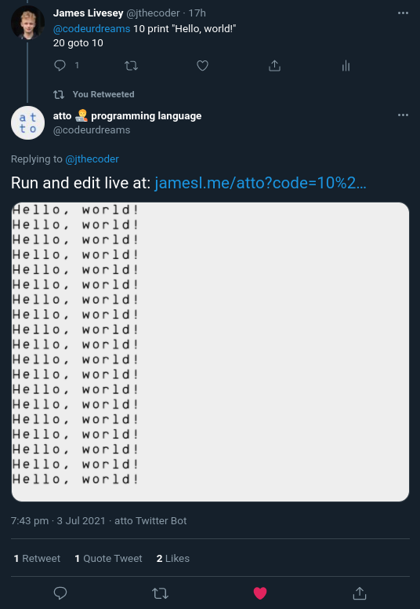
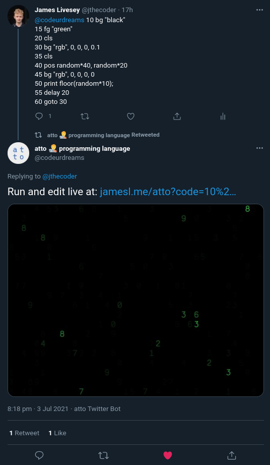
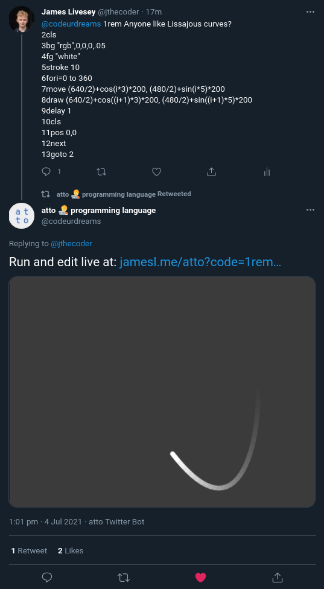

# `atto` Twitter Bot
This is [atto](https://github.com/devicefuture/atto)'s Twitter bot that executes programs that are Tweeted to it.

If your atto code can fit in a single Tweet, then feel free to send it to our [Twitter bot](https://twitter.com/codeurdreams) who'll then execute your code and reply to your Tweet with a screenshot of it running! Simply follow these steps:

1. Go to [atto.devicefuture.org](https://atto.devicefuture.org)
2. Write some atto code — type `help` to learn how
3. Run it to see if it works with `run`
4. Type `help`, then press **Tweet**, and review your code
5. Press the **Tweet** button and post your code to Twitter

Your code will be run for a total of 10 seconds before a screenshot is taken. Our bot will then reply ASAP!

## Demo Tweets
Here are just a few of the fun demos that can be Tweeted with our bot. Click on each image to go to the Twitter thread and see for yourself!

<table>
    <tr>
        <td>
            
        </td>
        <td>
            
        </td>
        <td>
            
        </td>
    </tr>
</table>

## Rules
Tweets to the bot **must start with a line number**, ignoring the mention to @codeurdreams. Otherwise, the bot will think you're just talking about something in written English and not actually sending code. You can use the `rem` statement (or `#`) to put a comment in your code and explain how it works!

Base2048 support is coming soon, which means you'll be able to compress your code and fit up to around 100 more code characters in a single Tweet! When this feature is ready, you'll be able to prepend the 🗜️ emoji to tell atto to interpret your code in base2048 mode.

## Reliability
This bot runs on a spare Raspberry Pi 3 which I've got laying around. I am attempting to provide the bot with a high uptime by running it 24/7, but it isn't guaranteed to work all of the time. Please let me know by DMming the bot's Twitter account if you think the bot's down!
